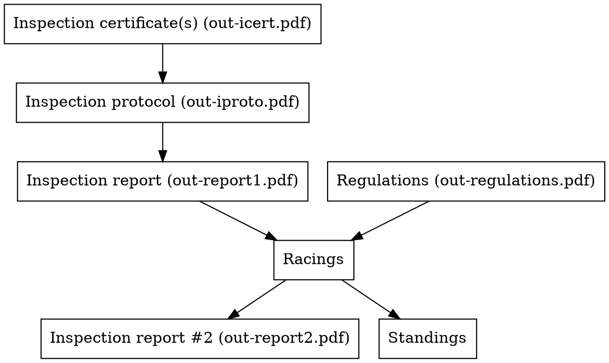

#   Racing reports

First lets look through the process

```graphviz
digraph {
    node [shape=box]
    
    icert [label="Inspection certificate(s) (out-icert.pdf)"]
    insproto [label="Inspection protocol (out-iproto.pdf)"];
    regulations [label="Regulations (out-regulations.pdf)"];
    report [label="Inspection report (out-report1.pdf)"];
    racings [label="Racings"];
    report2 [label="Inspection report #2 (out-report2.pdf)"];
    standings [label="Standings"];
    
    icert -> insproto;
    insproto -> report;
    regulations -> racings;
    report -> racings;
    racings -> report2;
    racings -> standings;
}
```
